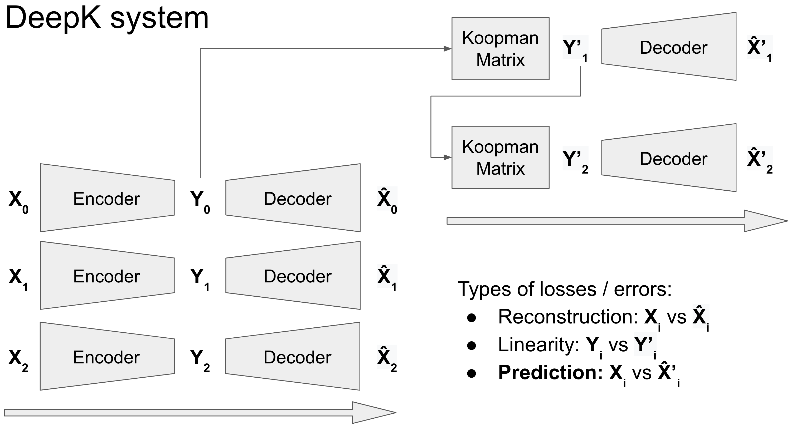
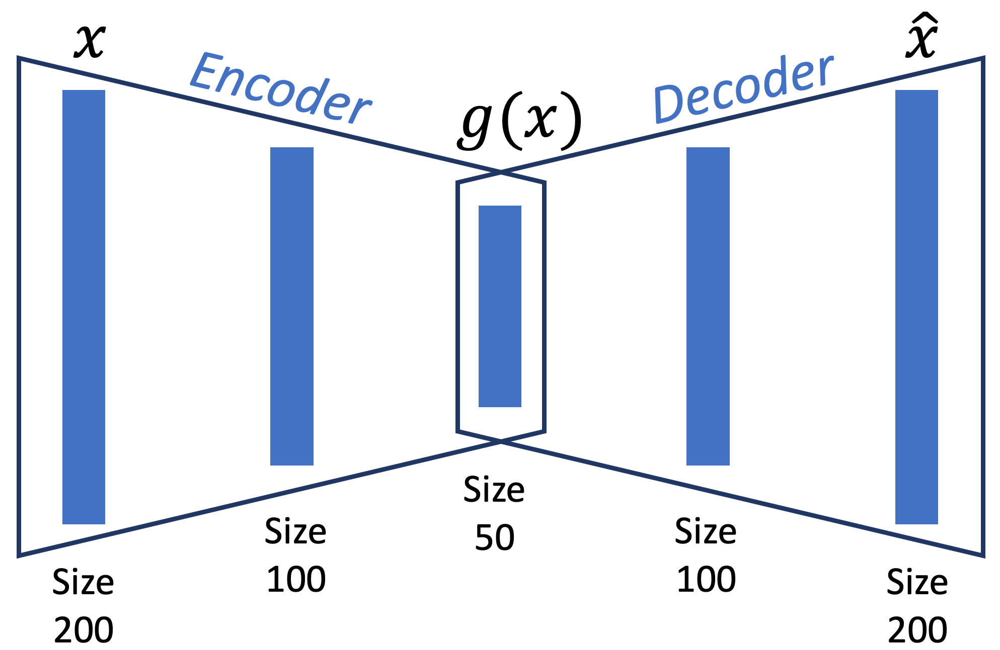

# deep-koopman
Koopman theory is a mathematical technique to achieve data-driven approximations of dynamical systems. This package implements Deep Koopman – a method to achieve Koopman approximations using *machine learning and deep neural networks* to learn the dynamics of any system and predict its unknown states.

We acknowledge the work of [Lusch et al.](https://github.com/BethanyL/DeepKoopman), which our work builds on and expands via the following key features:
- A generalized software tool to apply deep learning based Koopman theory to any system with arbitrary number of input components and amount of input data.
- Extensive options / hyperparameters to customize training and overcome the mathematical challenges of applying deep learning to Koopman theory.
- A ready-to-use hyperparameter search module to improve performance.
- Novel error functions for visualizing performance.
- Built using [Pytorch](https://pytorch.org/), supports both CPU and GPU platforms.

## Installation

### From source
```
git clone https://github.com/GaloisInc/deep-koopman.git
pip install -r requirements.txt
```
Add the location to your Python path, i.e. `export PYTHONPATH="<clone_location>/deep-koopman:$PYTHONPATH"`

### With pip
Details coming soon!

## API Reference
Available at https://galoisinc.github.io/deep-koopman/.

## Background
This section gives a brief overview. For a thorough mathematical treatment, refer to [`koopman_theory.pdf`](./koopman_theory.pdf).

Assume a dynamical system $x_{t+1} = F(x_t)$, where $x$ is the (multi-dimensional, i.e. vector) state of the system at index $t$, and $F$ is the evolution rule describing the dynamics of the system. Koopman theory attempts to transform $x$ into a different space $y = g(x)$ where the dynamics are linear, i.e. $y_{t+1} = Ky_t$, where $K$ is the Koopman matrix. Linearizing the system is incredibly powerful since the state $x_t$ at any $t$ can be predicted from $K$ and the initial state $x_0$ as $x_t = g^{-1}\left(K^tg(x_0)\right)$.

The Deep Koopman system in this package performs three tasks:
- *Reconstruction* (`recon`): Learn an autoencoder architecture to create the pipeline $\hat{x} = g^{-1}(y) = g^{-1}\left(g(x)\right)$.
- *Linearity* (`lin`): Learn a Koopman matrix which can operate on the initial encoded state $y_0$ to yield approximations $\{y_1',y_2',\cdots\}$ to the actual values $\{y_1,y_2,\cdots\}$, as well as predict unknown $y_t'$ for values of $t$ not in the given data.
- *Prediction* (`pred`): $\{y_1',y_2',\cdots\}$ are decoded to predict approximations $\{\hat{x}_1',\hat{x}_2',\cdots\}$ to the actual values $\{x_1,x_2,\cdots\}$, as well as predict unknown $\hat{x}_t'$ for values of $t$ not in the given data. This is the task we care about the most.
<figure><center>

</center></figure>

## Quick Tutorial
We will walk through a tutorial on predicting the $200$-dimensional pressure vector $x$ across the surface of a [NACA0012 airfoil](https://en.wikipedia.org/wiki/NACA_airfoil) at varying angles of attack $t$. Run `python examples/naca0012/run.py`. The script is broken down below:

### Data
```python
with open('./data.pkl', 'rb') as f:
    data = pickle.load(f)
```
The resulting `data` dictionary is documented [here](https://galoisinc.github.io/deep-koopman/core.html#deepk.core.DeepKoopman). Its contents are:
- `'ttr': range(15)`. Angle of attack values used for training. Note that the training indices must be in ascending order and should ideally be equally spaced.
- `'Xtr'` of shape `(15,200)`. Each row is the 200-dimensional pressure vector $x$ for the corresponding angle of attack (i.e. `Xtr[0]` corresponds to $x_0$).
- `'tva': [0.5,3.5,4.5,7.5,16,17,20]`, and `'tte': [1.5,2.5,5.5,6.5,15,18,19]`. Angle of attack values used for validating and testing the neural net, respectively. Note that these indices can be anything, order and spacing is not important.
- `'Xva'` and `'Xte'`. Pressure vectors corresponding to `'tva'` and `'tte'` (i.e. `Xva[0]` corresponds to $x_{0.5}$, `Xte[-1]` corresponds to $x_{19}$, etc).

### Deep Koopman run
```python
utils.set_seed(10)
```
This is an optional step used to seed the run. Since neural nets initialize their parameters randomly, setting the same random seed will ensure that your results are exactly the same as this tutorial.

```python
dk = DeepKoopman(
    data = data,
    rank = 6,
    num_encoded_states = 50
)
```
This creates the `DeepKoopman` object (documented [here](https://galoisinc.github.io/deep-koopman/core.html#deepk.core.DeepKoopman)). The `rank` is $6$, i.e. the Koopman matrix will be of dimension $6\times6$ (for more on `rank`, see [`koopman_theory.pdf`](./koopman_theory.pdf)). The encoded vector $g(x)$ will be $50$-dimensional. Since by default `encoder_hidden_layers = [100]`, the overall network looks like:
<figure><center>

</center></figure>

```python
dk.train_net()
dk.test_net()
```
Train and test the net. This uses all the default training settings, which can be found [here](https://galoisinc.github.io/deep-koopman/core.html#deepk.core.DeepKoopman).

### Results
If all goes well, you should see something like this in the console:
```
UUID for this run = <something>
100%|████████████████████████████████████████████████| 500/500
```
*Note*: You may get a `UserWarning: An output with one or more elements was resized`. Do not worry about this. Even though Pytorch complains, the matrix shapes are actually perfectly compatible.

```python
utils.plot_stats(dk, ['pred_loss', 'loss', 'pred_anae'])
```
This plots the [MSE loss](https://galoisinc.github.io/deep-koopman/losses.html#deepk.losses.mse) for the *prediction* task [described above](#background), as well as the [overall loss](https://galoisinc.github.io/deep-koopman/losses.html#deepk.losses.overall), which is a linear combination of losses from the three tasks and is optimized during training via gradient descent. It also plots the prediction [average normalized absolute error (ANAE)](https://galoisinc.github.io/deep-koopman/errors.html#deepk.errors.anae), which is a measure of the relative error between $x$ and $\hat{x}'$.

Your plots will be prefixed with the UUID, and should look like the ones in [`unopt_results`](./examples/naca0012/unopt_results/).

Despite [numerical instabilities](#numerical-instabilities) causing a spike early on in training, `loss` and `pred_loss` go down as expected and the final losses on test data are low. However, `pred_anae` on test data is $\sim46\%$, which isn't great, but also isn't surprising since we didn't optimize the training at all. Let's see if we can do better.

### Optimizing
Let's tweak the settings to:
```python
dk = DeepKoopman(
    data = data,
    rank = 6,
    num_encoded_states = 500,
    encoder_hidden_layers = [1000,500],
    numepochs = 1000,
    decoder_loss_weight = 0.1,
    K_reg = 0.,
    clip_grad_value = 2.
)
```
and again train, test, and plot stats. Your plots should now look like the ones in [`opt_results`](./examples/naca0012/opt_results/). We can see that the `pred_anae` on test data is now an impressive $6.95\%$, indicating that one can expect any predictions $x$ for some unknown $t$ to be within $7\%$ of the actual values.

This network might take close to a minute to train. Let's try stopping training early if the validation `pred_anae` does not improve for 50 epochs. Keep everything same as before, but add the following options:
```python
dk = DeepKoopman(
    # as before
    early_stopping = 50,
    early_stopping_metric = 'pred_anae'
)
```
Training is now faster, and stops after 555 epochs. Your plots should look like the ones in [`opt_es_results`](./examples/naca0012/opt_es_results/). The `pred_anae` on test data is slightly higher than before at $7.43\%$.

### Unknown state predictions
```python
print(dk.predict_new([3.75,21]))
```
This uses the trained DeepKoopman model to print predictions for $x_{3.75}$ and $x_{21}$, i.e. the unknown $200$-dimensional pressure vectors for angles of attack $3.75^{\circ}$ and $21^{\circ}$. Note that one of these $t$ values is in between the available $t$ values $3.5$ and $4$, while the other is beyond the available $t$ values. This demonstrates Deep Koopman's ability to perform *interpolation* and *extrapolation*.

## Hyperparameter search
You might be wondering how we arrived at the 'good' input settings in the optimization section. The method `deepk.hyp_search:run_hyp_search()` performs hyperparameter search by sweeping inputs to `DeepKoopman` and collecting the loss and ANAE values. These can then be used to select 'good' input settings.

Example code:
```python
from deepk.hyp_search import run_hyp_search
with open('examples/naca0012/data.pkl', 'rb') as f:
    data = pickle.load(f)
run_hyp_search(
    data = data,
    hyp_options = {
        'rank': [3,6,8,10],
        'num_encoded_states': [200,500,1000],
        'encoder_hidden_layers': [[500,500],[500,1000],[1000,500],[500,500,500]],
        'numepochs': 1000,
        'clip_grad_norm': [None,5.,10.]
        'clip_grad_value': [None,2.]
    },
    numruns = 100
)
```

We highly recommend performing hyperparameter search for any problem as it can lead to massively improved results and overcome numerical instabilities. If required, increase `numruns` to several hundred or even several thousand, which can take several hours to run, but the results are usually worth it.

## Numerical instabilities
The mathematical theory behind Deep Koopman involves operations such as singular value decomposition, eigenvalue decomposition, and matrix inversion. These can lead to the gradients becoming numerically unstable.

Some common numerical instabilities and ways to overcome them are described in the [issues](https://github.com/GaloisInc/deep-koopman/issues?q=is%3Aissue+is%3Aclosed).

Specifically, to debug gradient issues, insert the following line in your script:
```python
torch.autograd.set_detect_anomaly(True)
```
This catches runtime errors such as exploding `NaN` gradients and displays where they happened in the forward pass. The cost is slower execution. 

## Acknowledgements and Distribution Statement
This material is based upon work supported by the United States Air Force and DARPA under Contract No. FA8750-20-C-0534. Any opinions, findings and conclusions or recommendations expressed in this material are those of the author(s) and do not necessarily reflect the views of the United States Air Force and DARPA. Distribution Statement A, "Approved for Public Release, Distribution Unlimited."
